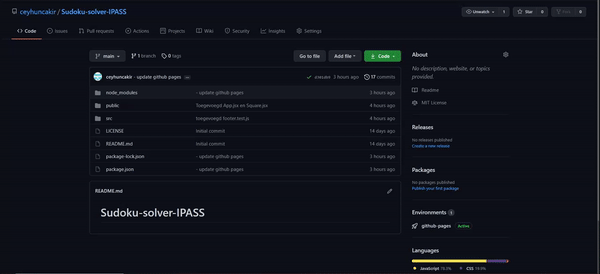
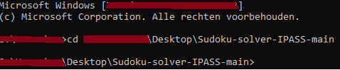
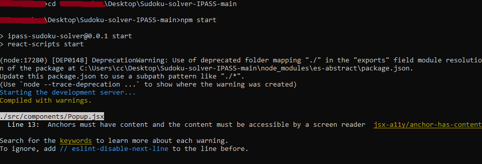
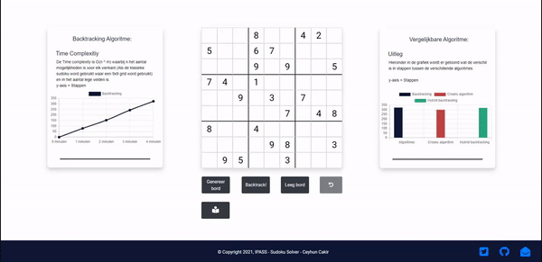

# Sudoku-solver-IPASS
In dit IPASS-project heb ik een sudoku solver gemaakt die een sudoku op een algoritmische manier de puzzel oplost. Ik heb een front-end gemaakt waar een gebruiker op een knop kan klikken om de sudoku op te lossen in een algoritmische manier. Verder krijgt de gebruiker ook de optie om zelf een sudoku te spelen op zijn of haar manier. Uiteindelijk is het doel van dit project dat het gebruiker te weten komt hoe een algoritme werkt voor een sudoku puzzel.
# Leden

```
Ceyhun Cakir : student nummer 1784480 : Email: ceyhun.cakir@student.hu.nl
```

# Installatie

```
Node JS (16.3.0^) via (https://nodejs.org/en/)
```

# Vereiste dependencies

Er zou verder geen dependencies geinstalleert moeten worden aangezien dit al in het package.json zit. Als er wel eventueel dependencies geinstalleert moeten worden of er missen dependencies kan dat gerust met de volgende command getoond hieronder

```
npm install {dependecie}
```

# Instructies

```
1: Download de source code zip file.
```


```
2: Zorg dat je in het (Main) folder zit.
```


```
3: Type: (Npm start)
```


```
4: De webserver zou nu draaiend moeten zijn op localhost:3000 :)
```


# Versie
1.0.0 | 19-06-2021
